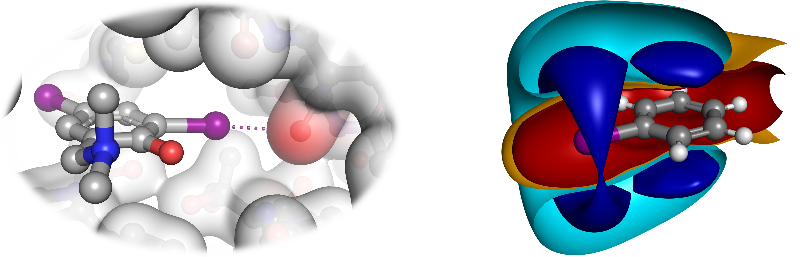
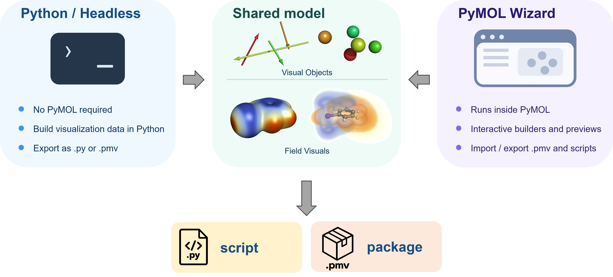
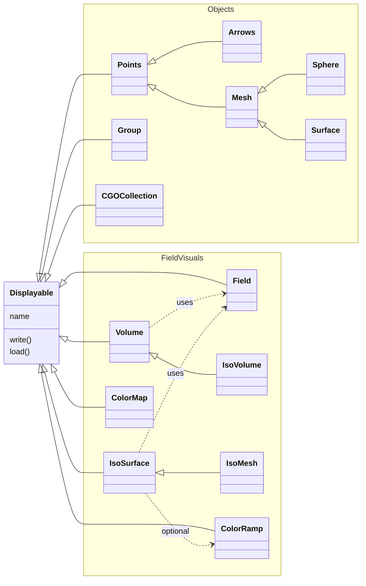

# PyMOLViz 2
[](https://pypi.org/project/pymolviz/) [](https://www.python.org/) [](LICENSE)

Build molecular visualization data in Python — headlessly or interactively inside PyMOL.



## Installation

```bash
pip install pymolviz
```

**Headless:** `import pymolviz` does not need PyMOL. You write `.py` scripts (run them inside PyMOL) or `.pmv` packs (re-open in the wizard).

**Wizard:** inside PyMOL’s Python:

```python
import pymolviz.wizard
```

Add that line to `.pymolrc` if you use the wizard often, then start it with:

```python
pmvw
```


## Quick headless example

```python
import numpy as np
import pymolviz as pmv

points = np.random.rand(10, 3) * 10
pmv.Points(points, color="red", name="basic_points").write("out/points.py")
```

Load `out/points.py` in PyMOL (`File → Run script…`). More geometry, volumes, MTZ maps, and `.pmv` packs are in `[examples/](examples/)`.

## Headless vs Wizard



PyMOLViz allows to create both 3D visual objects as well as field visuals via the wizard, as well as a headless pure API mode. Here technically no PyMOL is required to generate the scripts, however it is still required to view the results. This is mainly intended to help debug scripts or generate visuals on remote servers.

Visuals can be exported as pure python scripts, which dont require pymolviz to be installed in PyMOL to view them, or as more efficient pymolviz packages.

## Core concepts

Everything loadable in PyMOL is a `Displayable` (`name`, `.write()`). Two branches: **objects** (CGO geometry) and **field visuals** (voxel `Field` plus Volume / Iso*). `Script` is not a Displayable; it packs several of them into one `.py` file.


```mermaid
classDiagram
    direction LR

    class Displayable {
        name
        write()
        load()
    }

    namespace Objects {
        class Points
        class Arrows
        class Mesh
        class Sphere
        class Surface
        class Group
        class CGOCollection
    }

    namespace FieldVisuals {
        class Field
        class Volume
        class IsoVolume
        class IsoSurface
        class IsoMesh
        class ColorRamp
        class ColorMap
    }

    Displayable <|-- Points
    Displayable <|-- Group
    Displayable <|-- CGOCollection
    Points <|-- Arrows
    Points <|-- Mesh
    Mesh <|-- Sphere
    Mesh <|-- Surface

    Displayable <|-- Field
    Displayable <|-- Volume
    Displayable <|-- IsoSurface
    Displayable <|-- ColorRamp
    Displayable <|-- ColorMap
    Volume <|-- IsoVolume
    IsoSurface <|-- IsoMesh
    Volume ..> Field : uses
    IsoSurface ..> Field : uses
    IsoSurface ..> ColorRamp : optional
```


**Objects:** `Points` is the CGO root (arrows, meshes, spheres). `Group` keeps separate PyMOL objects; `CGOCollection` merges them into one.

**Field visuals:** `Field` is the brick (`values`, origin, spacing). `Volume` / `IsoSurface` / `IsoMesh` / `IsoVolume` wrap a Field. `ColorRamp` colors an isosurface by a Field; `ColorMap` is the transfer/colormap.

Generally everything that can be created with the wizard is also possible using headless mode using pure python.

The wizard holds additionally functionality:

- Remapping crystal fields onto objects.
- Support for more field types (TURBOMOLE xyz files, mtz files).
- Extensive colormap editor, with the ability to export corresponding colorbar as seperate image.
- Simple clipping planes for visual objects and field visuals.


## Futher steps

Generally all options and knobs are explained via tooltips in the wizard. In /examples, simple examples are given for most concepts.