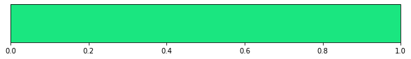
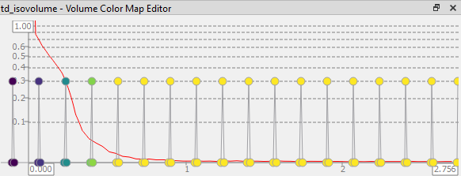
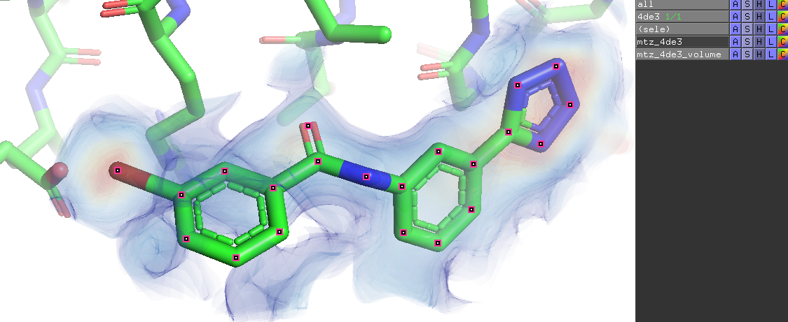

Despite its age, PyMOL is still a popular tool to display (and manipulate) molecular files. Unfortunately its great graphical capabilities are often hidden by incomplete documentation and obscure syntax. This python module is an attempt to comprehensively consolidate my understanding of these capabilities.

# Setup
## Requirements
* `numpy`
* `scipy`
* `matplotlib`
* `gemmi` if you want to load .mtz files

Surprisingly PyMOL is not necessarily required to run PyMOLViz, only to display the generated files. 


# Installation

In order to install the module you should navigate to the `module` folder and type:
```bash
pip install -e .
```
This should install the module in your current environment and automatically load any updates to the module.


# Introduction

The way that PyMOLViz is currently set up, it does not interact with PyMOL directly (although this is planned to be a possibility for a future update) but rather to generate python scripts that can then be loaded into PyMOL. This has the benefit that PyMOLViz does not have to run in the same environment (nor under the same operating system or even on the same computer) as PyMOL.

### Simple Example
In a simple example we will create a set of points and display them in PyMOL.
```python
import numpy as np
import pymolviz as pmv

points = np.random.rand(10, 3) * 10
pmv.Points(points).write("out/points.py")
```

This generates a python script in out:


When we load this into PyMOL we can see 10 points:


### Displayables
There are a couple of things of note here. PyMOLViz is based on so called _Displayables_. A _Displayable_ is everything that gets a seperate entry in the objects side bar in PyMOL in this example case _Points_1_.


Displayables can always be written to a script via the _write_ method and they always have a name. From the example we can see, that a dummy name will be generated if none is provided by the user.


# Points, Lines and Arrows

Some of the easiest to create and useful objects are points, lines and arrows (especially during debugging). These objects have the advantage over pseudo atoms or measurements that they are significantly less computationally intensive, allowing to display larger datasets.

## Points
_Points_ are defined by a set of _vertices_ (positions) and _color_. As they are inheriting from _Displayables_, they also have a name and can be written to a script via _write_.
```python
import numpy as np
import pymolviz as pmv

vertices = np.random.rand(10,3) * 10
p = pmv.Points(vertices, color = "red", name = "basic_points")

p.write("basic_points.py")
```


### Render Types
By default, points are rendered as Spheres. Even more performant is rendering them as "Dots" (pixels):
```python
p2 = pmv.Points(vertices, render_as="Dots", name = "dot_points")
p2.write("out/dot_points.py")
```


When rendering as spheres you can pass the additional keyword _radius_ which is 0.3 by default.
```python
p3 = pmv.Points(vertices, radius = 1, name = "larger_points")
p3.write("out/larger_points.py")
```


## Automatic color inference
Instead of passing a color as a string we can pass any value that is accepted by the _ColorMap_ class explained below. Specifically we can just pass a set of values and they will be automatically colored. For an example, we will color the points based on their distance to the origin:

```python
values = np.linalg.norm(vertices, axis = 1)
p2 = pmv.Points(vertices, color = values, name = "colored_points")
p2.write("out/colored_points.py")
```

For reference axes were added at the origin, see below in the Arrows chapter.

We can change the colormap beeing used by passing a different argument to _colormap_:
```python
p3 = pmv.Points(vertices, color = values, name = "viridis_points", colormap="viridis")
p3.write("out/viridis_points.py")
```


_colormap_ can be a string describing a [matplotlib colormap](https://matplotlib.org/stable/tutorials/colors/colormaps.html), a matplotlib colormap itself or a PyMOLViz.ColorMap. The latter is particularly useful if you want to customize your colormaps easily. 

As an example we will plot results of a electron density calculation for N-methyl acetamide as points (**you should almost never actually do this! Instead you should use a volumetric display as explained below.**). To easily read in the data we make use of the PyMOLViz GridData class which will be explained below.
```python
data = pmv.GridData.from_xyz("../data/td.xyz")
vertices = data.get_positions()
values = data.values
vertices = vertices[values > 1e-2]; values = values[values > 1e-2]
p4 = pmv.Points(vertices, color = values, render_as= "Dots", name = "td_points")
p4.write("out/td_points.py")
```


Almost all points get assigned a blue color. This is because the colors are normalized against the minimum and maximum values. The density exactly around the atoms is very large! In order to change the coloring into a more useful range, we pass a custom PyMOLViz colormap.
```python
p6 = pmv.Points(vertices, color = values, render_as= "Dots", name = "td_points", colormap = pmv.ColorMap([0, 0.5]))
p6.write("out/td_points.py")
```


## Lines
Instead of points lines can also be generated. For this the _Lines_ constructor can be used. Lines inherits from Points and also accepts a set of vertices as its first argument. Lines are then drawn between each 2 consecutive points. If the color argument is an array-like, it can either specify a color for each single line or each point.

```python
starts = np.random.rand(10,3) * 1
ends = np.random.rand(10,3) * 10
values = np.linalg.norm(ends, axis = 1)

l = pmv.Lines(np.hstack([starts, ends]), name = "basic_lines", color = values)
l.write("out/basic_lines.py")
```


With a color value for each point:
```python
values = np.full((5,4), ["yellow", "red", "green", "blue"]).flatten()
l2 = pmv.Lines(np.hstack([starts, ends]), name = "different_lines", color = values)
l2.write("out/different_lines.py")
```


## Arrows

Instead of just creating lines, the direction can be indicated via Arrows. Arrows inherit from lines.
Arrows get 2 additional keywords, indicating how their head should be shaped:
*head_length* and *head_width* both are relative values w.r.t. their length and default to .2.

If color is an array, it can either be passed as with lines, i.e. each line, or each end, or for each point of the arrow (first two for the line, next 8 for each line constituting the head).
```python
a1 = pmv.Arrows(np.hstack([starts, ends]), name = "basic_arrows", color = values)
a1.write("out/basic_arrows.py")
```

```python
values = np.random.rand(10,10, 3).reshape(-1, 3)
a2 = pmv.Arrows(np.hstack([starts, ends]), name = "random_arrows", color = values)
a2.write("out/random_arrows.py")
```

## Coordinate Axes

Using the _Arrows_ and the _Labels_ classes we can create coordinate axes:
```python
start = np.zeros((3,3))
end = np.eye(3)
a3 = pmv.Arrows(np.hstack([start, end]), name = "coordinate_axes_arrows", color = end)
labels = pmv.Labels(end * 1.1, name = "coordinate_axes_labels", labels = ["x", "y", "z"])
pmv.Group([a3, labels], "coordinate_axes").write("out/coordinate_axes.py")
```


# Colors
Colors in PyMOLViz are exclusively determined via the _ColorMap_ class.

## ColorMap
One of the most reoccuring tasks is to apply a colormap to a set of values. In order to simplify this as much as possible, PyMolViz has implemented an auxiliary ColorMap class which automatically tries to gracefully interpret different types of input.

## Display
The colormap class implements two functions to display them. One to show them as a matplotlib figure:
```python
cmap.get_figure(orientation = "horizontal", figsize=(10, 1))
```
As in:
```python
def plot_colors(cmap, x):
    # plotting given points
    test_colors = cmap.get_color(x)
    print("\n\nColored points:")
    plt.scatter(x, np.full_like(x, 0.5), color = test_colors)
    plt.show()

    #plotting the colorbar
    print("Colorbar:")
    cmap.get_figure(orientation = "horizontal", figsize=(10, 1))
```

The other way is to show them as a ColorRamp in PyMOL:
```python
values = [-2, 0, 0, 3]
color_values = [0, 0.4, 0.65, 1]
cmap = pmv.ColorMap(list(zip(values, color_values)), name ="colormap")
cmap.write("colormap.py")
```


## Inputs
In the following every possible _color_ input to the ColorMap class is discussed.
**Single Color Input**
Sometimes instead of a color for every point / line / mesh, you just want a single color (this is in fact the default if no color is passed). For this the colormap can be passed only a single color and will assign this color to any value that is passed to it.
Single Color Inputs can be:
* **A colors name**
```python
cmap = pmv.ColorMap("red")
plot_colors(cmap, np.random.rand(10) * 10)
```


* **An elements name (which then gets converted based on pymols element colors)**
```python
cmap = pmv.ColorMap("I")
plot_colors(cmap, np.random.rand(10) * 10)
```


* **An array-like with 3 or 4 entries as rgb (a), either indicating values as float between 0 and 1 or as integer between 0 and 255.**
```python
cmap = pmv.ColorMap([0.1, 0.9, 0.5])
plot_colors(cmap, np.random.rand(10) * 10)
```





**Multiple Color Input**
The more interesting case is if you want to assing different colors to different values. For this the ColorMap class can infer the colormap scaling from a set of values passed to it. In this case the passed *colormap* keyword is used to infer the colormaps colors. Alternatively if a list of single colors (see above) is passed to it, it will map each index to the corresponding color.
Multiple Color Inputs can be:
* **An array-like containing float-like values (colors are taken from a matplotlib colormap corresponding to the passed *colormap* argument. Defaults to *"RdYlBu_r"*.)**
```python
values = np.random.rand(10) * 10
cmap = pmv.ColorMap(values, colormap="viridis")
plot_colors(cmap, values)
```


* **An array-like containing single colors (see above)**
```python
cmap = pmv.ColorMap(["red", "I", [0.3, 0.4, 0.7], [10, 250, 100]])
plot_colors(cmap, range(4))
```


**Linear Segmented Color Input**
If you want to assign certain colors to certain values, you can pass a list of tuples to the ColorMap, with each tuple (value, color) containing the value and the corresponding single color (see above).
Alternatively tuples of (value, color_value) pairs can be passed. In this case color_value may be a float between 0 and 1 or an integer between 0 and 255 indicating the color based on the passed *colormap* keyword.
Linear Segmented Color Inputs can be:
* **An array-like containing tuples of (float-like, single color (see above)).**
```python
values = [0.1, 0.5, 0.6, 2]
colors = [(50, 10, 255), "Br", "Cl", "black"]
cmap = pmv.ColorMap(list(zip(values, colors)))
plot_colors(cmap, values)
```


* **An array-like containing tupes of (float-like, color-indicator) with color-indicator being a float between 0 and 1. The colors are then determined by passing the color-indicator to the matplotlib colormap corresponding to the passed *colormap* argument (Defaults to *"RdYlBu_r"*).**
```python
values = [-2, 0, 0, 3]
color_values = [0, 0.4, 0.65, 1]
cmap = pmv.ColorMap(list(zip(values, color_values)))
plot_colors(cmap, values)
```


# Meshes and Primitives

## Meshes
In addition to the basic data representions presented thus far, PyMOLViz also provides an Interface to the Mesh representation in PyMOL. Such a mesh has, in addition to points and colors also faces and vertex normals. 

**Faces** should be a list or array of 3 dimensional indices into vertices. Faces indicate which 3 vertices should be connected to generate an opaque triangle. If faces are not given, every 3 consecutive points are assumed to form a triangle.

As a mesh will display an actual surface the additional information of the direction of the surface is used to compute lighting on the surface. For this, **vertex normals** can be provided which should for every provided vertex indicate the surface normal at that vertex. If you have no information of vertex normals you can either compute them from surrounding vertices or just pass zero vectors.
```python
import pymolviz as pmv
import numpy as np

# creating dummy points
points = np.array([[0, 0, 0], [0, 0, 1], [0, 1, 0]])
colors = np.array(["red", "green", "blue"])

# creating a point mesh of the dummy points, rendering the points as spheres
p = pmv.Points(points, color = colors, name ="points")

# creating the actual mesh. As we dont know the vertex normals, we set them to 0 vectors. The faces input means, the points at index 0, 1 and 2 should be connected to create a triangle. Any color between vertices is interpolated (by PyMOLs shaders).
m = pmv.Mesh(points, faces = [[0, 1, 2]], normals = np.zeros_like(points), color = colors, name = "mesh")

pmv.Script([m, p]).write("out/test_mesh.py")
```


We can also load larger meshes into PyMOL, to display arbitrary objects:
```python
bunny_points = np.load('../data/Bunny.npy')
m2 = pmv.Mesh(bunny_points, color = "beige", name = "bunny")
m2.write("out/bunny.py")
```


### Wireframes
Any mesh can be turned into a wireframe via the _to_wireframe_ method. Note that this is different from an IsoMesh that is created using volumetric data, which is explained further below.
```python
bunny_points = np.load('../data/Bunny.npy')
l = m2.to_wireframe(name = "bunny_wireframe")
l.colormap = pmv.ColorMap("black")
l.write("out/bunny_wireframe.py")
```


## Mesh Primitives
PyMOLViz currently also provides the _Plane_ and _Sphere_ classes, which allow to instantiate plane and sphere meshes more easily.
* The _Plane_ class represents a mesh consisting of two triangles which are placed at a given `position` and with a given plane `normal`. The size of the triangles is controlled by the `scale` parameter.
* The _Sphere_ class allows to create a sphere directly as a mesh (allowing to e.g. extract its wireframe representation). If you want to represent many points as spheres, you should use the _Points_ class instead. The _sphere_ is defined by its `position`, `radius` and its `resolution`, determining how many points are approximating a circle.

```python
start_point = np.array([1,1,1])

# creating plane
normal = np.array([1,1,-1])
plane = pmv.Plane(start_point, normal, scale = 2, color = "blue", name = "plane")

# creating sphere
sphere = pmv.Sphere(start_point, 0.3, color = "green", name = "sphere")

# joining meshes into a script
s = pmv.Script([plane, sphere])
s.write("test_primitives.py")
```


# Collections, Groups and Scripts
Up to now we basically always created a _Displayable_ and used its _write_ method to generate a corresponding script. In reality we will usually want to combine different _Displayables_ and write them to a single script. The classes _CGOCollection_, _Group_, and _Script_ all allow to gather different _Displayables_ but have distinct use cases.

## CGOCollection
_CGOCollections_, as the name indicates are collections of CGOs, **C**ompiled **G**raphics **O**bjects.  In PyMOLViz this corresponds to every class that inherits from _Points_. This includes every class except for the ColorMap that has been presented thus far. However it specifically excludes any volumetric class. 

CGOCollections are _Displayables_ and have therefore a _name_ and a _write_ function. They are special in that all _Displayables_ that are part of a _CGOCollection_ will be combined and appear in PyMOL as the **same** _Displayable_ under the name of the Collection (unless they are also added by different means).
```python
points = pmv.Points(np.random.rand(10,3), color = (1,0,0), name = "points")
lines = pmv.Lines(np.hstack([np.random.rand(10,3), np.random.rand(10,3)]), color = (0,1,0), name = "lines")
collection = pmv.CGOCollection([points, lines], name = "collection")
collection.write("basic_collection.py")
```


## Groups
Groups are used to gather multiple _Displayables_. Other than with _CGOCollections_, any other _Displayable_ **that is not a _Group_** can be gathered. They are part of PyMOLs GUI. They are themselves also _Displayables_ and therefore a _name_ and a _write_ function. Any _Displayable_ that is part of a _Group_ will also be loaded into PyMOL itself. We made use of the _Group_ class when implementing the coordinate axes.
```python
start = np.zeros((3,3))
end = np.eye(3)
a3 = pmv.Arrows(np.hstack([start, end]), name = "coordinate_axes_arrows", color = end)
labels = pmv.Labels(end * 1.1, name = "coordinate_axes_labels", labels = ["x", "y", "z"])
g = pmv.Group([a3, labels], "coordinate_axes")
g.write("out/coordinate_axes.py")
```


## Scripts
_Scripts_ lie at the root of the implementation of PyMOLViz as any _Displayable_ is converted to a _Script_ when its _write_ function is called. The _Script_ class is used to actually convert its _Displayables_ into runnable python scripts. It can be used to gather different _Displayables_ which should be loaded with a single script. **_Scripts_ themselves are not _Displayables_ but rather represent a collection of _Displayables_ that should be converted into a single python script.**

We could use the _Script_ class to write the coordinate axes and the bunny to a single script:
```python
bunny_points = np.load('../data/Bunny.npy')
m2 = pmv.Mesh(bunny_points, color = "beige", name = "bunny")
s = pmv.Script([g, m2])
s.write("out/bunny_with_coordinates.py")
```


# Volumetric Displays
PyMOL has different capablities for displaying volumetric data, such as electrostatic potentials or electron density. These all are based on data on a three dimensional grid, which is why the interface to volumetric displays in PyMOLViz is always based on the _GridData_ class.

## GridData
Volumetric Displays are all based on the _GridData_ class. As the name implies it stores data on a grid. The grid can either be specified by its _positions_ or by an _origin_, _step_sizes_ and _step_counts_, each being a 3-dimensional vector. **_step_counts_ here means the number of steps taken from origin, specifically not counting origin as a step. Thus, the number of grid points along one axis _i_ is _step_counts\[i\] + 1_.** 

At least currently, non-orthogonal Grids are not supported. _GridData_ is a _Displayable_, and thus can be loaded into PyMOL on its own.

As a simple example we create a 1 by 1 cube at \[0, 0, 0\] and assign values as the  manhatten distance from origin.
```python
grid = np.array([[0, 0, 0],
        [0, 0, 1],
        [0, 1, 0],
        [0, 1, 1],
        [1, 0, 0],
        [1, 0, 1],
        [1, 1, 0],
        [1, 1, 1]])

values = np.sum(grid, axis=1) # manhatten distance from origin
grid_data = pmv.GridData(values, grid, name = "basic_grid_data")
grid_data.write("basic_grid_data.py")
```


As no display type has been added yet, PyMOL will only show the bounding box of the loaded 3d-grid. For better comprehensiveness, the coordinate axes from the section before was added.

If you like to see the points of the _GridData_, you can convert them into a _Points_ class using the _to_points_ method.
```python
points = grid_data.to_points(name = "grid_data_points", radius = 0.1)
points.write("out/basic_grid_data_points.py")
```


## Reading external volumetric data
PyMOLViz currently supports reading xyz files containing volumetric data created by turbomole, as well as mtz files using [_gemmi_](https://gemmi.readthedocs.io/en/latest/). With time and demand additional formats will follow.

### Reading xyz files
One example was already in the _Points_ chapter:
```python
td_data = pmv.GridData.from_xyz("../data/td.xyz", name = "td")
points = td_data.to_points(name = "td_points", radius = 0.1, render_as="Dots")
pmv.Script([td_data, points]).write("out/td_points.py")
```


The _from_xyz_ function has the argument _in_bohr_ which defaults to True. This signifies that the data from the xyz file is in Bohr (as is the default for turbomole outputs), but we want to see it in Angström. If you want to leave the data in its original form you need to pass `in_bohr = False`. 

### Reading mtz files
Reading mtz files is more complicated, since they usually hold a lot of information and you need to pick what information you would like to display. If you want more than a quick way to display the information you need to take a deeper look into the documentation, e.g. for the [MTZ Format](https://www.ccp4.ac.uk/html/mtzformat.html) or how to handle them with [gemmi](https://gemmi.readthedocs.io/en/latest/hkl.html).

PyMOLViz allows to specify the structure factor column and the phase column from the mtz file to compute the grid data. additionally you can specify the sample rate and the area in which to display the data via the _min_pos_ and _max_pos_ keywords.

For standard files you want the following structure factors and phases (see https://www.globalphasing.com/buster/wiki/index.cgi?MTZcolumns, https://www.ccp4.ac.uk/html/refmac5/keywords/xray-general.html):
* 2mFo-dFc: Factor: "FWT", Phase: "PHWT"
* mFo-dFc: Factor: "DELFWT", Phase: "PHDELWT"
* Fc: Factor: "FC", Phase: "PHIC"
* Fo: Factor: "FP", Phase: usually N/A
```python
from rdkit import Chem
prot = Chem.MolFromPDBFile('../data/4de3.pdb')
positions = prot.GetConformer().GetPositions()
buffer = 5
min_pos = np.min(positions, axis = 0) - buffer
max_pos = np.max(positions, axis = 0) + buffer
mtz_data = pmv.GridData.from_mtz('../data/4de3_phases.mtz', min_pos = min_pos, max_pos = max_pos, step_sizes = [1, 1, 1], name = 'mtz_4de3')
mtz_data.write("out/mtz_4de3.py")
```


## Volumes
Once the data is available there are two major types of displaying them. Via transparent _Volumes_ or via _IsoSurfaces_. First we will show how to use _Volumes_. _Volumes_ are _Displayables_ and therefore have a _name_ and can be written directly as a script via the _write_ method.

```python
v1 = pmv.Volume(grid_data, name = "grid_data_volume")
v1.write("out/basic_volume.py")
```


With the volume panel looking like:


To refine the coloring you can access the volume color map panel via the color of the volumes:


A _Volume_ is defined by values which are mapped to (color, alpha) value pairs, with the color for every point inbetween being interpolated. In PyMOLViz, this is done by specifying the _alphas_ and _clims_ keywords for the _Volume_. The _clims_ define the values at which a new color is used by passing the clim to the _Volume's_ _ColorMap_, which can be specified using the _colormap_ keyword in a similar fashion to the _Points_ class.

As an example we will try to show a clearer distinction between points below 1.5 and above 1.5 by adjusting our colormap:
```python
values = [np.min(grid_data.values), 1.5, 1.5, np.max(grid_data.values)]
color_values = [0, 0.35, 0.65, 1]
cmap = pmv.ColorMap(list(zip(values, color_values)), name="distinct_colormap")
v2 = pmv.Volume(grid_data, name = "distinct_volume", colormap = cmap)
pmv.Script([v2, cmap]).write("out/distinct_volume.py")
```


With the volume panel looking like:


If we dont want to distinguish so many colors, we can pass different _clims_ to the _Volume_ constructor:
```python
clims = [
    np.min(grid_data.values),
    np.mean(grid_data.values),
    np.max(grid_data.values)
]
v3 = pmv.Volume(grid_data, name = "less_colors_volume", clims = clims)
v3.write("out/less_colors_volume.py")
```


With the volume panel looking like:


This doesn't look perfect. The way that the alpha values are determined by default, it is assumed that the first clim is at a high alpha value and the second goes down to a low alpha value. Thus, the follow would be more correct:
```python
clims = [
    np.min(grid_data.values),
    np.mean(grid_data.values),
    np.mean(grid_data.values),
    np.max(grid_data.values),
    np.max(grid_data.values)
]

v4 = pmv.Volume(grid_data, name = "less_colors_volume2", clims = clims)

v4.write("out/less_colors_volume2.py")
```


With the volume panel looking like:


Instead we can also pass the alpha values ourselves:
```python
clims = [
    np.min(grid_data.values),
    np.mean(grid_data.values),
    np.max(grid_data.values)
]
alphas = [0.03, 0.005, 0.03]
v3 = pmv.Volume(grid_data, name = "less_colors_volume3", clims = clims, alphas = alphas)
v3.write("out/less_colors_volume3.py")
```


With the volume panel looking like:


By default the clims are chosen as 33 even spaced values between mean plus/minus 5 standard deviations. The alpha values are chosen based on the point densities between the points in that region.

As a more practical example we will show the density around the N-methyl acetamide:
```python
data = pmv.GridData.from_xyz("../data/td.xyz", name = "td")
cmap = pmv.ColorMap([0, 0.5])
v4 = pmv.Volume(data, name = "td_volume", colormap = cmap)
v4.write("out/td_volume.py")
```


### IsoVolumes
Sometimes it is hard to see what is going on using Volumes (at least in their default setting). In order to simplify generating Volumes showing iso-surfaces PyMOLViz has the class _IsoVolume_. It still makes use of the PyMOLs volume functionality but creates "coloring peaks" at the given values.

```python
cmap = pmv.ColorMap([0, 0.5], colormap = "viridis")
v5 = pmv.IsoVolume(data, name = "td_isovolume", colormap = cmap)
v5.write("out/td_isovolume.py")
```


With the volume panel looking like:



Displaying the 2mFo-dFc map from before we get:
```python
from rdkit import Chem
prot = Chem.MolFromPDBFile('../data/4de3.pdb')
positions = prot.GetConformer().GetPositions()
buffer = 5
min_pos = np.min(positions, axis = 0) - buffer
max_pos = np.max(positions, axis = 0) + buffer
data = pmv.GridData.from_mtz('../data/4de3_phases.mtz', min_pos = min_pos, max_pos = max_pos, step_sizes = [1, 1, 1], name = 'mtz_4de3')
cmap = pmv.ColorMap([-1, 1])
v6 = pmv.IsoVolume(data, name = "mtz_4de3_volume", colormap = cmap)
v6.write("out/mtz_4de3_isovolume.py")
```


Zooming in, we can see some detail, but it is still hard to make out, due to the everything beeing quite dense:


### Carve
In order to limit where the volume is displayed, we can pass a name of a PyMOL object (that should exist at the time we load the script), and a radius around that object to display the volume. The name is passed via the keword _selection_ and the carve radius via the keyword _carve_.
```python
v7 = pmv.IsoVolume(data, name = "mtz_4de3_volume", colormap = cmap, carve = 2, selection = "4de3")
v7.alphas[v6.alphas > 0] = 1
v7.write("out/mtz_4de3_isovolume_carved.py")
```


To show the volume within 2 Angström around the selection at the time the script is loaded we can use the following:
```python
cmap = pmv.ColorMap([0, .7])
v8 = pmv.IsoVolume(data, clims = np.linspace(0, 1, 32), name = "mtz_4de3_volume", colormap = cmap, carve = 2, selection = "sele")
v8.alphas[v8.alphas > 0] = 1
v8.alphas[v8.alphas == 0] = 0.05
v8.write("out/mtz_4de3_isovolume_carved_sele.py")
```


```python
cmap.get_figure(orientation = "horizontal", figsize = (12, 1))
```


Here we had selected the entire region of the protein when reading in the mtz file and then carved down the display to the selection. A better way to do it would be to restrict the selection of the read in of the mtz file to the region you are interested in.
```python
# bfs from a bromine
bromine = [a for a in prot.GetAtoms() if a.GetAtomicNum() == 35][0]
cur_indices = [bromine.GetIdx()]; found_indices = [bromine.GetIdx()]
while(len(cur_indices) > 0):
    next_indices = [a.GetIdx() for a in prot.GetAtomWithIdx(cur_indices[0]).GetNeighbors() if a.GetIdx() not in found_indices]
    found_indices.extend(next_indices)
    cur_indices.extend(next_indices)
    cur_indices = cur_indices[1:]

# determine box
used_positions = np.array([positions[i] for i in found_indices])
min_pos = np.min(used_positions, axis = 0) - buffer
max_pos = np.max(used_positions, axis = 0) + buffer

#read in data
data = pmv.GridData.from_mtz('../data/4de3_phases.mtz', min_pos = min_pos, max_pos = max_pos, step_sizes = [1, 1, 1], name = 'mtz_4de3')

#create Volume
cmap = pmv.ColorMap([0, 1])
clims = np.linspace(0, 2, 32)
v9 = pmv.IsoVolume(data, name = "mtz_4de3_volume", colormap = cmap, selection = "sele", carve = 2, clims = clims)
v9.alphas[v9.alphas > 0] = 1
v9.write("out/mtz_4de3_isovolume_small.py")
```


```python
cmap.get_figure(orientation = "horizontal", figsize = (12, 1))
```


## IsoSurfaces
While transparent volumes are a good tool to show volumetric data, we are sometimes not interested in all of the volumetric data or we want to combine two different volumetric information. For this we can use _IsoSurfaces_. They are defined by _GridData_ and a _level_. The surface that is drawn is then determined by the points where the values of the GridData correspond to the _level_. As those points generally do not fall onto the grid points themselves, [PyMOL uses a form of marching cubes to determine the surface](https://pymolwiki.org/index.php/Isosurface).

_IsoSurfaces_ are _Displayables_ and therefore have a _name_ and can be written directly as a script via the _write_ method.

We'll start with our simple cube example to get a feeling for the IsoSurfaces:
```python
grid = np.array([[0, 0, 0],
        [0, 0, 1],
        [0, 1, 0],
        [0, 1, 1],
        [1, 0, 0],
        [1, 0, 1],
        [1, 1, 0],
        [1, 1, 1]])
values = np.sum(grid, axis=1)

grid_data = pmv.GridData(values, grid, name = "grid_data")
s1 = pmv.IsoSurface(grid_data, 1.5, name = "basic_surface")
labels1 = pmv.Labels(grid, values, name = "basic_labels")
pmv.Script([s1, labels1]).write("out/basic_surface.py")
```


We can see that the surface is drawn exactly at the level 1.5 given a linear interpolation between grid points.


### ColorRamps
One important use-case of _IsoSurfaces_ is to map data from different GridData onto it. For now we will create another mock-data giving the (euclidean) distance to \[0, 0, 1\].
```python
values2 = np.linalg.norm(grid - np.array([0,0,1]), axis=1)
grid_data2 = pmv.GridData(values2, grid, name = "grid_data2")
labels2 = pmv.Labels(grid, [f"{v:.3f}" for v in values2], name = "basic_labels2")
pmv.Script([grid_data2, labels2]).write("out/grid_data2.py")
```


In order to color an _IsoSurface_ from another _GridData_, we now need to create a _ColorRamp_ object. _ColorRamps_ assign a color from a _ColorMap_ to every point of a _GridData_ based on its value on that point (similar to what is done with _Points_).
Thus a _ColorRamp_ takes in a _GridData_ object under the keyword _data_, detailing the grid points and their values as well as a _colormap_ (which again can be a string mapping onto matplotlib colormaps, a matplotlib colormap itself or a PyMOLViz _ColorMap_).

_ColorRamps_ are _Displayables_ and therefore have a _name_ and can be written directly as a script via the _write_ method.

As an example, we will create a _ColorRamp_ from the euclidean distance data and map it onto the IsoSurface for the manhatten distance.

```python
c_ramp = pmv.ColorRamp(grid_data2, name = "color_ramp")
s2 = pmv.IsoSurface(grid_data, 1.5, name = "colored_surface", color = c_ramp)
pmv.Script([s2, labels]).write("out/colored_surface.py")
```


Using the N-methyl acetamide example, we can draw an IsoSurface at a density level of 0.01
and color it by the electrostatic potential. To set a surface's transparency, we can use the _transparency_ keyword.

```python
density_data = pmv.GridData.from_xyz("../data/td.xyz", name = "density_data")
potential_data = pmv.GridData.from_xyz("../data/tp.xyz", name = "potential_data")
cmap = pmv.ColorMap([0, 0.2])
c_ramp2 = pmv.ColorRamp(potential_data, name = "color_ramp2", colormap = cmap)
s3 = pmv.IsoSurface(density_data, 0.01, name = "potential_surface", color = c_ramp2, transparency = 0.2)
s3.write("out/potential_surface.py")
```


## IsoMeshes
Sometimes _IsoSurfaces_ are unclear and a less obtrusive visualization is preferred. For this, _IsoMeshes_ can be used. _IsoMeshes_ effectively show the result of the Marching Cubes algorithm as a wireframe. They inherit from _IsoSurfaces_ and accept the same arguments, only differing in the way they are displayed.

```python
m3 = pmv.IsoMesh(density_data, 0.01, name = "potential_mesh", color = c_ramp2)
m3.write("out/potential_mesh.py")
```


This can also be used to show the 2mFo-dFc density:
```python
from rdkit import Chem
prot = Chem.MolFromPDBFile('../data/4de3.pdb')
positions = prot.GetConformer().GetPositions()
buffer = 5

# bfs from a bromine
bromine = [a for a in prot.GetAtoms() if a.GetAtomicNum() == 35][0]
cur_indices = [bromine.GetIdx()]; found_indices = [bromine.GetIdx()]
while(len(cur_indices) > 0):
    next_indices = [a.GetIdx() for a in prot.GetAtomWithIdx(cur_indices[0]).GetNeighbors() if a.GetIdx() not in found_indices]
    found_indices.extend(next_indices)
    cur_indices.extend(next_indices)
    cur_indices = cur_indices[1:]

# determine box
used_positions = np.array([positions[i] for i in found_indices])
min_pos = np.min(used_positions, axis = 0) - buffer
max_pos = np.max(used_positions, axis = 0) + buffer

data = pmv.GridData.from_mtz('../data/4de3_phases.mtz', min_pos = min_pos, max_pos = max_pos, step_sizes = [1, 1, 1], name = 'mtz_4de3')

m4 = pmv.IsoMesh(data, name = "mtz_4de3_mesh", level = 0, selection = "sele", carve = 2, color = "black")
m4.write("out/mtz_4de3_mesh.py")
```


## Dependencies between Displayables
For more complex _Displayables_ multiple other _Displayables_ are required to draw them properly. Generally this is handled automatically, e.g. when writing a _Volume_, the corresponding _GridData_ is written as well. If you want to organize these in _Groups_, you need to explicitly add all dependencies to the _Group_.
```python
g = pmv.Group([density_data, potential_data, c_ramp2, m3], name = "potential_mesh_group")
g.write("out/potential_mesh_group.py")
```


